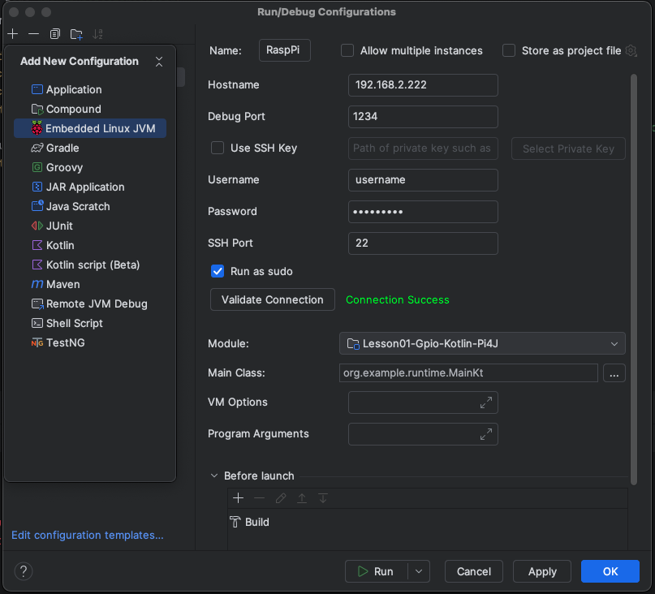

### Kotlin Gpio project. Working with IO lines on Raspberry Pi using Pi4J Kotlin/Java langs and remote compiling / debugging to any ARM GPIO compatible hardware. Advanced AI features (TensorFlow)


[All tutorails and videos on my YouTube channel](https://www.youtube.com/@OleksandrNeiko)


## LESSON 05: Work with button. Button listeners.


#### Step 1: Add logic to Button class

````
package avatar.hardware.parts

import com.pi4j.context.Context
import com.pi4j.io.gpio.digital.*
import runtime.setup.Configuration

class Button(pi4j: Context, buttonConfig: Configuration.ButtonConfig) {

    private lateinit var buttonInput: DigitalInput

    init {
        buildButton(pi4j, buttonConfig)
    }

    private fun buildButton(pi4j: Context, buttonConfig: Configuration.ButtonConfig) {
        val params = DigitalInput.newConfigBuilder(pi4j)
            .id("BCM${buttonConfig.pin}")
            .name(buttonConfig.name)
            .address(buttonConfig.pin)
            .debounce(DigitalInput.DEFAULT_DEBOUNCE)
            .pull(
                when (buttonConfig.pullResistance) {
                    0 -> PullResistance.PULL_DOWN
                    1 -> PullResistance.PULL_UP
                    else -> PullResistance.PULL_DOWN
                }
            )
            .build()

        buttonInput = pi4j.create(params)
    }

    fun addButtonListeners(actionHigh: () -> Unit, actionLow: () -> Unit) {
        buttonInput.addListener(DigitalStateChangeListener { e: DigitalStateChangeEvent<*> ->
            if (e.state() == DigitalState.HIGH) {
                println("${buttonInput.name} was pressed") //TODO add to event emitter
                actionHigh()
            }
            if (e.state() == DigitalState.LOW) {
                println("${buttonInput.name} was unpressed") //TODO add to event emitter
                actionLow()
            }

        })

    }
}
````


#### Step 2: Create fun in typed body interface

````
    fun addButtonListeners(buttonPosition: Int = 0, actionHigh: () -> Unit, actionLow: () -> Unit): Boolean
````

#### Step 3: Override fun for button listeners in implementation of body interface

````
    override fun addButtonListeners(buttonPosition: Int, actionHigh: () -> Unit, actionLow: () -> Unit): Boolean {
        if (buttonPosition < 0) return false

        if (buttonPosition < body.buttons.size) {
            body.buttons[buttonPosition].addButtonListeners(actionHigh, actionLow)
            return true
        }
        return false
    }
````


#### Step 4: Interact with button and add listeners in Main thread

````
   if (avatar.type == HardwareTypes.Type.CIRCUIT_BOARD) {
        var counter = 0

        (avatar.body as CircuitBoard).addButtonListeners(
            buttonPosition = 0,
            actionHigh = {
                counter++
                (avatar.body as CircuitBoard).ledOn(0)
            },
            actionLow =  {
                (avatar.body as CircuitBoard).ledOff(0)
                if (counter > 4) {
                    (avatar.body as CircuitBoard).ledOn(1, 5000L)
                    counter = 0
                }
            }
        )

    }
````

#### * Additional settings: remote compiling / debugging setup


Add new launch configuration to IntelliJ IDEA


fill IP / port adress to Raspberry PI. Username & password as sudo connection. Add Main Kotlin class and project module.


